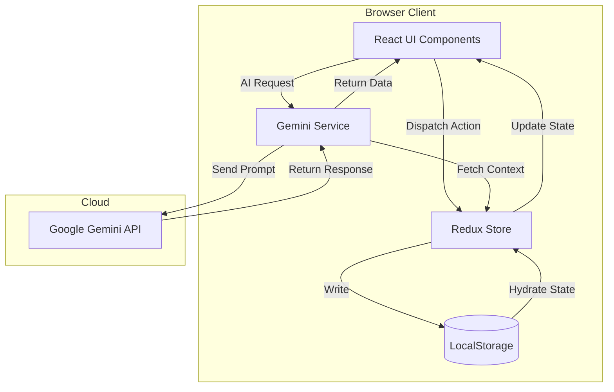
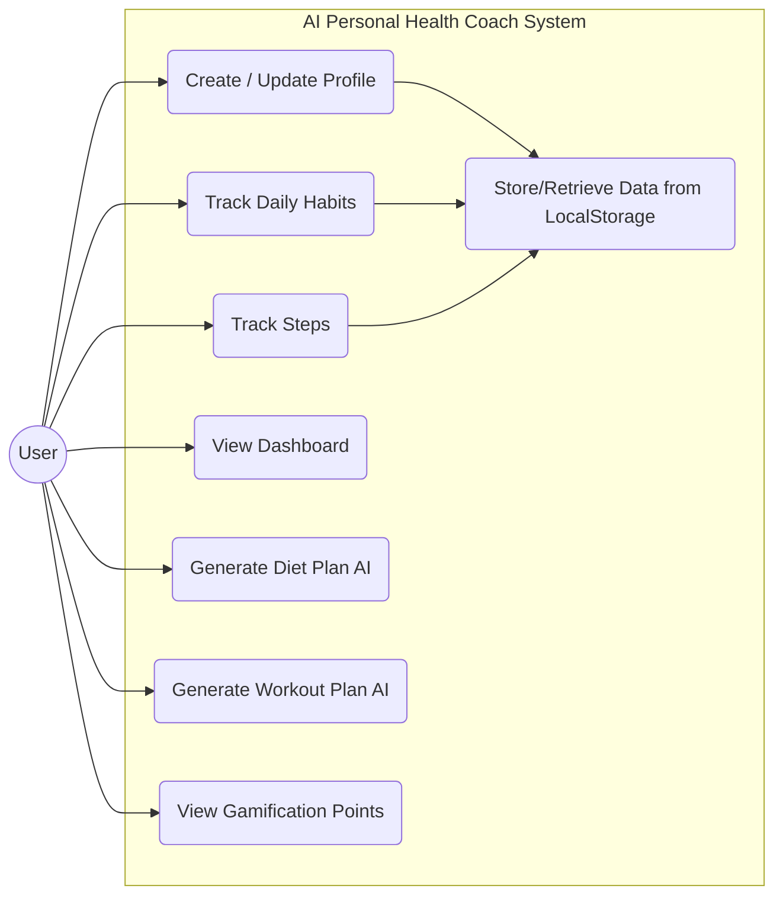
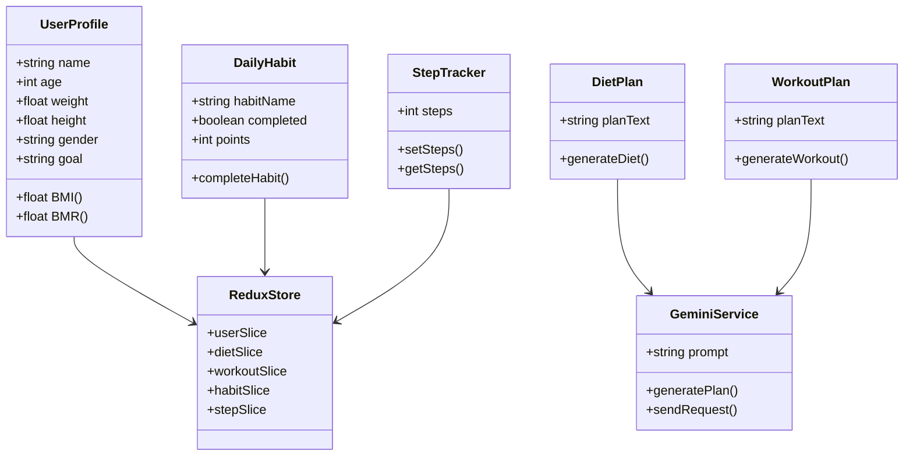
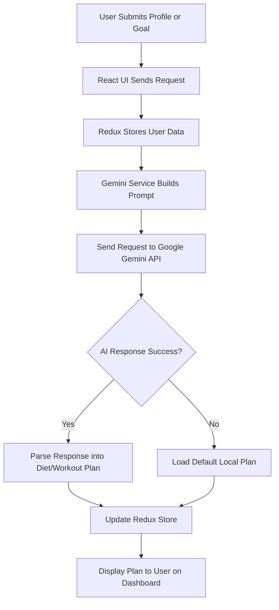
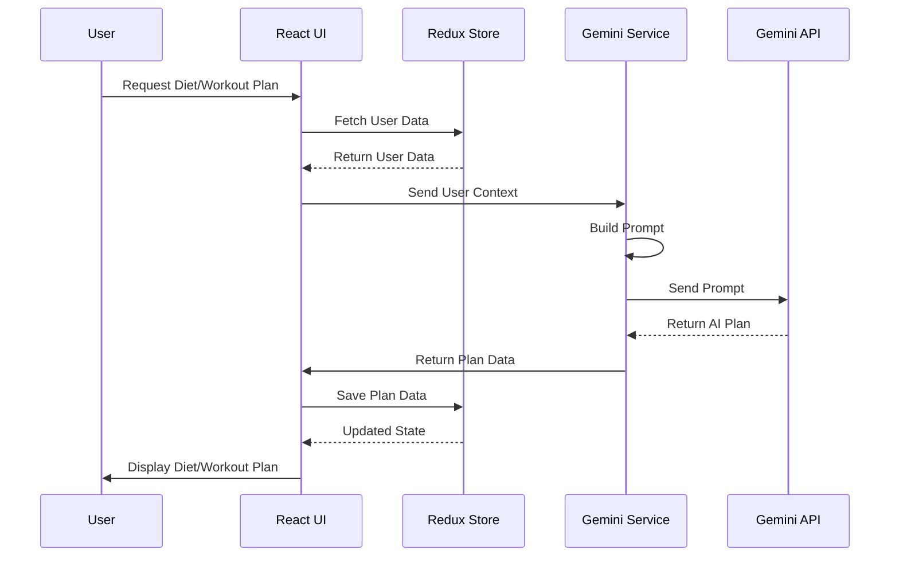
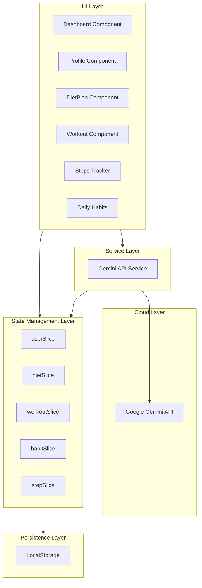
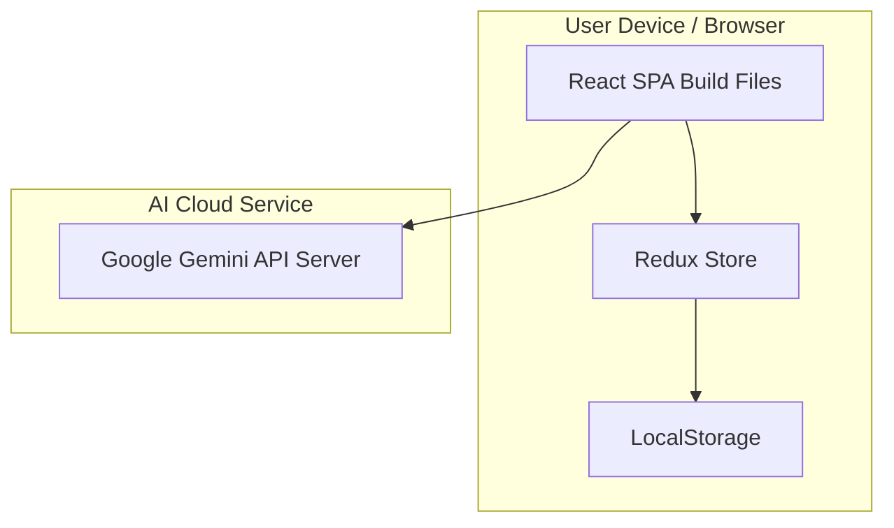

# Chapter 1: Introduction and Overview

## 1.1 System Overview

The **AI Personal Health Coach** system integrates modern web technologies with **Generative Artificial Intelligence (GenAI)** to provide personalized health management. It delivers actionable health insights, AI-generated diet and workout plans, gamified progress tracking, and real-time user engagement through an interactive front-end interface.

This chapter describes the software development methodology, architectural design, theoretical foundations, and functional modules of the system. It also includes UML diagrams that illustrate the system’s design and interactions.

## 3.2 System Development Plan

### 3.2.1 Development Approach

The system follows a **Component-Based Architecture (CBA)**, dividing the application into independent, reusable, and maintainable components. In the React environment, this ensures modular code, efficient UI rendering, and enhanced testability.

**Theoretical Justification:**

*   **Encapsulation:** Components such as `UserProfile` and `DietPlan` manage their own logic, reducing overall complexity.
*   **Reusability:** UI elements like buttons, inputs, and cards are atomic components, maintaining visual consistency.
*   **Unidirectional Data Flow:** **Redux** enables predictable state transitions, simplifying debugging.
*   **Declarative UI:** **React** updates the UI based on state, abstracting direct DOM manipulations.

**Key Modules Developed:**

1.  **State Management Module (Redux):** Maintains user data, health metrics, plans, and gamification progress.
2.  **AI Integration Service:** Handles communication with the **Google Gemini API** for personalized health plans.
3.  **User Interface Layer:** Implements responsive screens for profile, dashboard, diet, and workouts.
4.  **Persistence Layer:** Stores data locally via **LocalStorage**.
5.  **Gamification Engine:** Calculates points, tracks daily habits, and motivates engagement.

### 3.2.2 Software Development Model

The project follows the **Agile Development Model**, suitable for AI integration and iterative prompt engineering.

**Justification:**

*   **Iterative Prompt Refinement:** Ensures accurate and safe AI-generated recommendations.
*   **Rapid Prototyping:** Validates UI and usability of health tracking features.
*   **Adaptive Scope:** Agile accommodates adding features like gamification in later sprints.

**Agile Phases Used:**

1.  **Conceptualization:** Defined core health metrics (BMI, BMR) and user goals.
2.  **Architecture Design:** Finalized state schema and component hierarchy.
3.  **Implementation:** Developed React components and Redux slices.
4.  **AI Integration:** Implemented Gemini API communication and prompt engineering.
5.  **Verification:** Tested data persistence, functional correctness, and AI output.

### 3.2.3 Technology Stack

| Layer | Technology | Justification |
| :--- | :--- | :--- |
| **Frontend Framework** | **React 19 (Vite)** | Efficient UI rendering and fast build environment. |
| **State Management** | **Redux Toolkit** | Centralized state management and predictable transitions. |
| **Styling** | **Tailwind CSS 4** | Utility-first CSS for rapid and consistent UI development. |
| **Artificial Intelligence** | **Google Gemini API** | Provides personalized AI-generated diet/workout plans. |
| **Persistence** | **Browser LocalStorage** | Ensures privacy by storing data locally on the user’s device. |
| **Language** | **TypeScript** | Enables static typing, safer code, and better maintainability. |

## 3.3 System Architecture

### 3.3.1 High-Level Architecture

The system adopts a **Client-Side Single Page Application (SPA)** architecture with **serverless AI integration**. All logic and state are managed in the browser, while AI computations are offloaded to the Gemini API.

**Architecture Layers:**

1.  **Presentation Layer (View):**
    *   Renders UI components and captures user interactions.
    *   Implemented using React functional components and hooks.

2.  **State Management Layer (Controller):**
    *   Centralized Redux store manages global state.
    *   Handles actions like updating user data or generating health scores.

3.  **Service Layer (Integration):**
    *   Communicates with the Gemini API to generate personalized plans.
    *   Builds AI prompts using current user data.

4.  **Persistence Layer (Model):**
    *   Stores user data in LocalStorage for browser-based durability.
    *   Hydrates Redux store on page load to maintain state.

### 3.3.2 Data Flow Diagram (Textual Representation)

## 3.4 System Modules Description

### 3.4.1 User Profile Management Module

*   **Purpose:** Stores user demographic and physical data (age, weight, height, gender, goals).
*   **Implementation:** `userSlice.ts`
*   **Functionality:** Computes BMI, BMR, and other derived metrics for AI personalization.

### 3.4.2 Daily Habits & Gamification Module

*   **Purpose:** Encourages engagement through points and streaks.
*   **Implementation:** `dailyHabitsSlice.ts`
*   **Functionality:** Logs habits (water intake, sleep, steps). Completion updates points and progress in Redux.

### 3.4.3 AI Plan Generation Module

*   **Purpose:** Generates diet and workout plans personalized to the user.
*   **Implementation:** `gemini.ts`, `dietSlice`, `workoutSlice`
*   **Process:**
    1.  Collect user data and generate structured prompt.
    2.  Send prompt to Gemini API.
    3.  Parse AI response and display plan.
    4.  **Fallback:** Default local plan used if API is unavailable.

### 3.4.4 Footsteps Tracker Module

*   **Purpose:** Tracks physical activity and integrates it with health score.
*   **Implementation:** `footStepsTracker` component.

## 3.5 AI Development & Prompt Engineering

### 3.5.1 Approach

Uses **Prompt Engineering** instead of training ML models. Focus is on designing input queries to elicit desired outputs.

### 3.5.2 Prompt Strategy

*   **Role Prompting:** AI is assigned the persona “Expert Health Coach”.
*   **Context Injection:** Dynamic embedding of user data (weight, height, goal).
*   **Constraint Specification:** Limits output length, style, and tone for usability.

### 3.5.3 Verification

Ensures AI output is safe, non-harmful, and consistent across sessions.

## 3.6 Security & Privacy Considerations

*   **Local Data Storage:** Personal data stored only on the user's device.
*   **API Security:** Gemini API key protected using environment variables.
*   **Stateless AI Interaction:** Gemini API does not retain user data.

## 3.7 Deployment Plan

*   **Build:** `vite build` compiles TypeScript and bundles assets.
*   **Hosting:** Deployable on Netlify, Vercel, or GitHub Pages.
*   **CI/CD:** Optional pipelines for automatic builds and deployments.

## 3.8 UML Diagrams

### 3.8.1 Use Case Diagram

### 3.8.2 Class Diagram

### 3.8.3 Activity Diagram (AI Plan Generation)

### 3.8.4 Sequence Diagram (AI Plan Generation)

### 3.8.5 Component Diagram

### 3.8.6 Deployment Diagram

