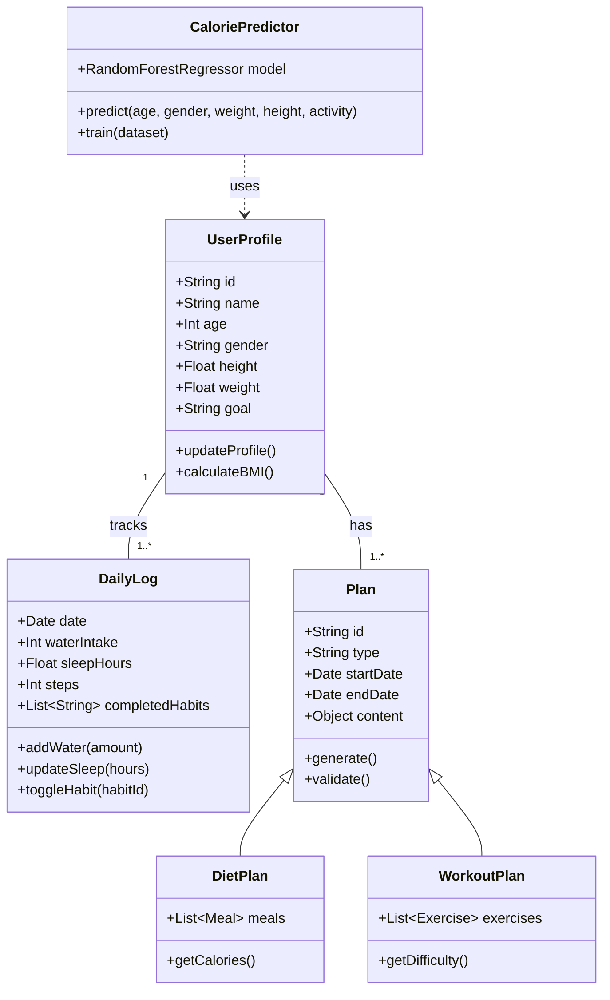
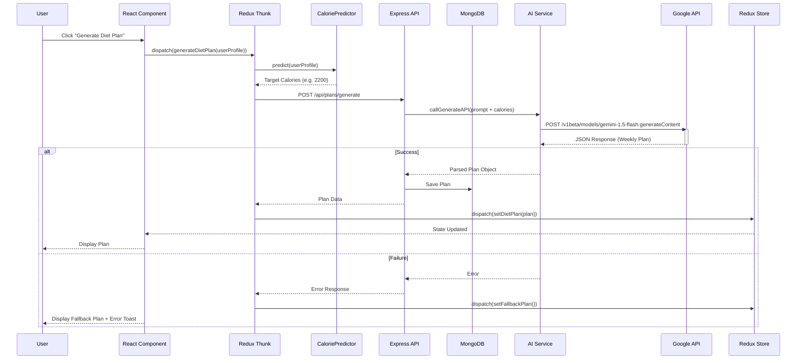
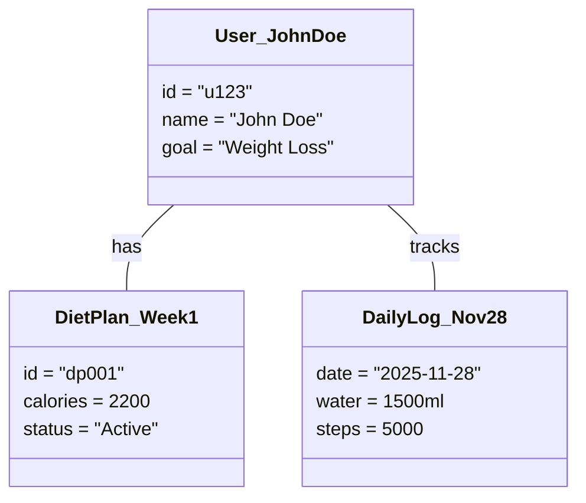
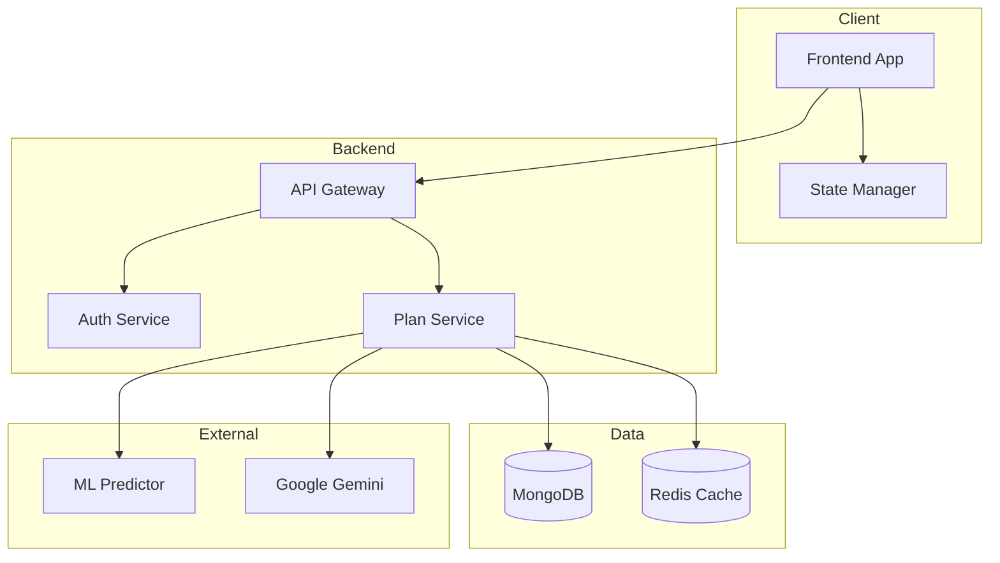
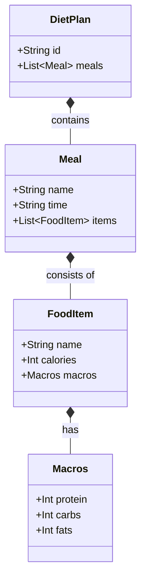
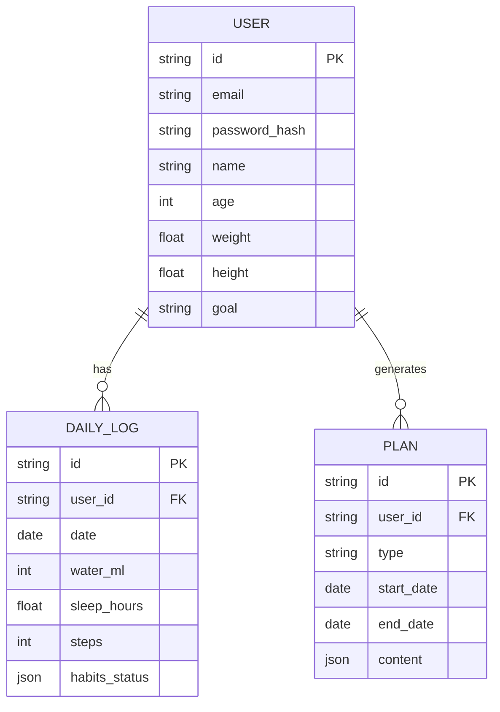
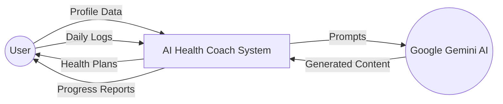
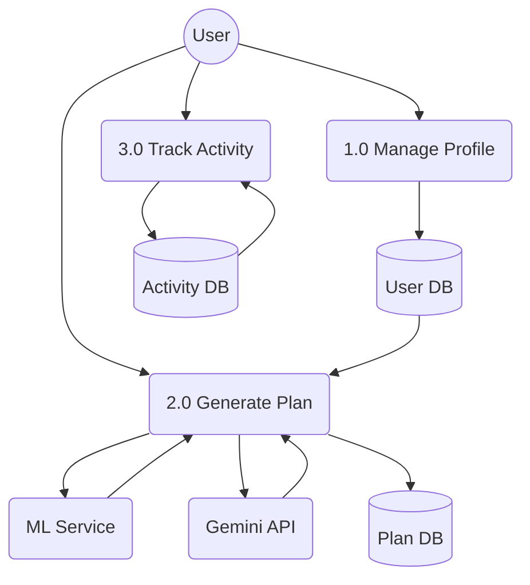

# UML Diagrams

## 1. Use Case Diagram
Visualizes the interactions between actors and the system.

```mermaid
usecaseDiagram
    actor "User" as U
    actor "AI System (Gemini)" as AI
    actor "System Admin" as Admin

    package "AI Health Coach System" {
        usecase "Create Profile" as UC1
        usecase "View Dashboard" as UC2
        usecase "Generate Diet Plan" as UC3
        usecase "Generate Workout Plan" as UC4
        usecase "Log Daily Activity" as UC5
        usecase "Track Progress" as UC6
        usecase "Manage System Config" as UC7
    }

    U --> UC1
    U --> UC2
    U --> UC3
    U --> UC4
    U --> UC5
    U --> UC6

    UC3 ..> AI : Include
    UC4 ..> AI : Include

    Admin --> UC7
```

## 2. Class Diagram
Represents the static structure of the system's data and components.



## 3. Sequence Diagram: Generate Diet Plan
Shows the dynamic interaction during plan generation.



## 4. Activity Diagram: Daily Check-in
Flowchart of the daily user routine.

```mermaid
activityDiagram-v2
    start
    :Open Dashboard;
    if (New Day?) then (yes)
        :Reset Daily Counters;
        :Archive Previous Day Log;
    else (no)
        :Load Current Progress;
    endif

    fork
        :Log Water Intake;
    fork again
        :Log Sleep Hours;
    fork again
        :Log Steps;
    fork again
        :Check off Habits;
    end fork

    :Calculate Daily Score;
    if (Score >= Goal?) then (yes)
        :Show Success Animation;
        :Award Bonus Points;
    endif
    
    :Save to LocalStorage;
    stop
```

## 5. Deployment Diagram
Illustrates the physical deployment of artifacts.

```mermaid
deploymentDiagram
    node "Client Device" {
        component "Web Browser" {
            artifact "React SPA"
        }
    }

    node "Cloud Infrastructure" {
        node "CDN / Host" {
            artifact "Static Assets (HTML/JS/CSS)"
        }
        
        node "Backend Server" {
            component "Node.js + Express"
        }

        node "ML Service" {
            component "Python + FastAPI"
        }

        node "Database Cluster" {
            database "MongoDB"
        }
        
        node "Google Cloud Platform" {
            component "Gemini API"
        }
    }

    "Web Browser" -- "HTTPS" --> "CDN / Host" : Requests Assets
    "Web Browser" -- "HTTPS/REST" --> "Backend Server" : API Calls
    "Backend Server" -- "TCP" --> "MongoDB" : Read/Write Data
    "Backend Server" -- "HTTP/gRPC" --> "ML Service" : Prediction Requests
    "Backend Server" -- "HTTPS/REST" --> "Gemini API" : Generates Content
```

## 6. Object Diagram
Snapshot of objects and their relationships at a specific point in time.



## 7. Component Diagram
Depicts the high-level software components and their dependencies.



## 8. Package Diagram
Organizes the system classes into logical packages.

```mermaid
classDiagram
    namespace Client_Layer {
        class Components
        class Pages
        class ReduxSlices
        class ApiServices
    }

    namespace Server_Layer {
        class Controllers
        class DataModels
        class ExpressRoutes
        class Middleware
    }

    namespace ML_Layer {
        class TrainingScripts
        class InferenceService
        class ModelRegistry
    }

    Client_Layer ..> Server_Layer : HTTP/JSON
    Server_Layer ..> ML_Layer : Internal API
```

## 9. Composite Structure Diagram
Details the internal structure of the `DietPlan` and `WorkoutPlan` classes.



## 10. Communication Diagram
Shows the collaboration between objects for the "Daily Check-in" process.

```mermaid
graph LR
    User((User))
    UI[Dashboard UI]
    Ctrl[Controller]
    Store[Redux Store]
    API[Backend API]
    DB[(Database)]

    User -- 1. Clicks Check-in --> UI
    UI -- 2. Dispatches Action --> Ctrl
    Ctrl -- 3. Updates State --> Store
    Ctrl -- 4. Syncs Data --> API
    API -- 5. Persists Log --> DB
    DB -.-> API : Confirm
    API -.-> Ctrl : Success
    Ctrl -.-> UI : Show Notification
```

## 11. Entity Relationship Diagram (ERD)
Visualizes the database schema and relationships.



## 12. Data Flow Diagram (DFD)
Shows how data moves through the system.

### Level 0: Context Diagram


### Level 1: Process Diagram

